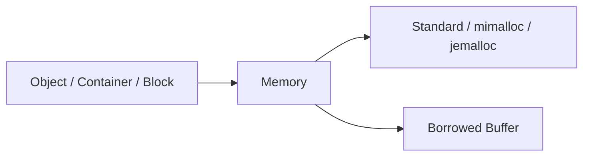

# UniMemory

[](https://github.com/dugan-dev/UniMemory/actions/workflows/ci.yml)

**A unified C++20 memory allocation library for Standard, mimalloc and jemalloc.**

**English** · [简体中文](README.zh-CN.md) · **0.0.1**

Object construction, container allocation and aligned memory through a consistent API. Standard requires no third-party allocator; mimalloc and jemalloc are optional backends.

[Start](#quick-start) · [Features](#features) · [Backends](#backends) · [Platforms](#platforms) · [Performance](#performance) · [Tests](#tests) · [Docs](#documentation)

## Quick start

```cpp
#include <unimem/memory.h>

struct Point {
    float x;
    float y;
};

int main() {
    unimem::Memory& memory = unimem::Memory::global();
    Point* point = memory.create<Point>(1.0f, 2.0f);
    memory.destroy(point);
}
```

`create<T>()` allocates and constructs an object; `destroy()` destroys and frees it. The same Object and Container API also works with Heap and Stack Memory.

### Build and run

Requires **C++20**, **CMake 3.25+** and a C++ compiler.

```sh
git clone https://github.com/dugan-dev/UniMemory.git
cd UniMemory
cmake --preset release -DUNIMEMORY_BUILD_EXAMPLES=ON
cmake --build --preset release
ctest --preset release
```

### CMake integration

```cmake
add_subdirectory(UniMemory)
target_link_libraries(app PRIVATE UniMemory::UniMemory)
```

Tests default off in a parent project. [Install / find_package](docs/getting-started.md) · [Runnable examples](examples/README.md)

## Features

| Topic | Provides | Common API |
| --- | --- | --- |
| [Object / Array](docs/guides/objects.md) | Construction, destruction, smart pointers | `create<T>()`, `destroy()`, `make_unique<T>()` |
| [Container](docs/guides/containers.md) | Standard containers and PMR | `allocator<T>()`, `resource()` |
| [Block](docs/guides/raw-memory.md) | Alignment, resize, automatic release | `make_block()`, `resize()` |
| [Heap](docs/guides/heap.md) | Independent allocation group | `reset()`, `collect()`, `owns()` |
| [Stack](docs/guides/stack.md) | Temporary allocation in a fixed buffer | `mark()`, `rewind()` |
| [Statistics](docs/guides/statistics.md) | Allocation counts and memory usage | `statistics()`, `backend_statistics()` |



`Memory` provides one allocation API: `global()` for shared allocation, `heap()` for an independent Heap, `stack()` for a fixed Buffer. [API reference](docs/api-reference.md)

### Three entry points

| Entry | Use |
| --- | --- |
| `Memory::global(backend)` | Shared default allocation |
| `Memory::heap(backend)` | Independent Heap, bulk release |
| `Memory::stack(buffer)` | Fixed Buffer, checkpoint-based reuse |

## Backends

| Capability | Standard | mimalloc | jemalloc |
| --- | :---: | :---: | :---: |
| Objects, containers, blocks | ✓ | ✓ | ✓ |
| Allocation counters | ✓ | ✓ | ✓ |
| Independent Heap | — | ✓ | ✓ |
| Process backend statistics | — | Committed / reserved | Build-dependent |
| Unused memory release delay | — | ✓ | ✓ |
| Extra dependency | None | Optional | Optional |

```cpp
unimem::Memory& memory = unimem::Memory::global(unimem::Backend::Mimalloc);
```

Optional backends are enabled at build time; `capabilities()` reports supported features. Ordinary `new` and unadapted containers retain their own allocation paths. [Backend configuration](docs/guides/backends.md)

## Platforms

| Platform | Validation scope |
| --- | --- |
| Windows x64 / MSVC | Three backends, checked locally |
| Linux x64 / GCC / WSL | Three backends, installed package, local benchmarks |
| macOS / Apple Clang | Three backends and installed package, GitHub CI |
| Android / iOS | Not device-validated |

Google TCMalloc can be linked into the final Linux program; it is not a `Backend` enum value. [Build conditions](docs/guides/backends.md)

## Performance

### Allocation time

Windows x64, MSVC 19.44, Xeon w9-3595X; statistics off. **Nanoseconds per operation; lower is faster.** Median of three process medians, seven repetitions each.

| Workload | Standard | mimalloc | jemalloc |
| --- | ---: | ---: | ---: |
| `make_unique`, 64 B | 46.4 | 12.2 | 36.0 |
| vector, 32 integers | 590.3 | 237.4 | 488.5 |
| Block resize, 4 → 8 KiB | 168.5 | 139.8 | 149.4 |
| Cross-thread free, 8 threads | 105.4 | 59.8 | 166.6 |

Object includes creation and destruction; vector includes growth and destruction; resize includes allocation, resize and free. The cross-thread test allocates on one thread and frees on eight threads.


Standard = 1 within each workload; shorter is faster. [More workloads and API overhead](docs/performance/latency.md)

Backend performance depends on workload, platform and configuration. [Performance report](docs/performance.md)

## Tests

| Validation | Result |
| --- | --- |
| Windows: three backends + examples | **1626/1626** in Release and Debug |
| Linux: three backends + examples | **1627/1627**, installed consumer passes |
| macOS: three backends + examples | **1626/1626**, installed consumer passes |
| ASan / UBSan, Standard and Stack | **681/681** |
| ThreadSanitizer, Standard and Stack | **678/678** |
| Linux Standard linked to TCMalloc | **671/671** |
| Independent GitHub clone/install | Standard **681/681**; static/shared consumers pass |
| Unified correctness tests | **240 loop cases/backend + 240 Stack cases**, plus random, exception, concurrency and stress tests |
| Backend test suites | Reproduction scripts: mimalloc, jemalloc, test-only rpmalloc, TCMalloc |

Results cover the tested builds; mobile devices remain unverified. [Test coverage and CI](docs/testing.md)

## Documentation

| Section | Topics |
| --- | --- |
| 1 · Start | [Build and install](docs/getting-started.md) → [Object](docs/guides/objects.md) |
| 2 · Everyday | [Container](docs/guides/containers.md) · [Block](docs/guides/raw-memory.md) |
| 3 · Advanced | [Heap](docs/guides/heap.md) · [Stack](docs/guides/stack.md) · [Statistics](docs/guides/statistics.md) |
| 4 · Reference | [API](docs/api-reference.md) · [Performance](docs/performance.md) · [Full index](docs/README.md) |

## License

[MIT](LICENSE). Optional allocators retain their respective licenses.
