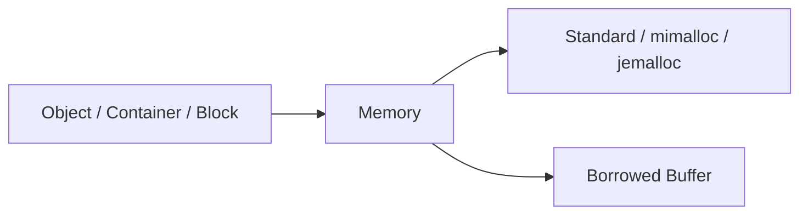

# UniMemory

[](https://github.com/dugan-dev/UniMemory/actions/workflows/ci.yml)

**统一的 C++20 内存分配库，支持 Standard、mimalloc 和 jemalloc。**

[English](README.md) · **简体中文** · **0.0.1**

通过统一 API 提供 Object 创建、Container 分配和对齐内存管理。Standard 无第三方分配器依赖；mimalloc、jemalloc 为可选 Backend。

[开始使用](#快速开始) · [功能](#功能) · [Backend](#backend) · [平台](#平台) · [性能](#性能) · [测试](#测试) · [文档](#文档)

## 快速开始

```cpp
#include <unimem/memory.h>

struct Point {
    float x;
    float y;
};

int main() {
    unimem::Memory& memory = unimem::Memory::global();
    Point* point = memory.create<Point>(1.0f, 2.0f);
    memory.destroy(point);
}
```

`create<T>()` 分配内存并构造 Object；`destroy()` 析构并释放。两者使用同一个 `Memory` 实例。

### 编译运行

需要 **C++20**、**CMake 3.25+** 和 C++ 编译器。

```sh
git clone https://github.com/dugan-dev/UniMemory.git
cd UniMemory
cmake --preset release -DUNIMEMORY_BUILD_EXAMPLES=ON
cmake --build --preset release
ctest --preset release
```

### CMake 接入

```cmake
add_subdirectory(UniMemory)
target_link_libraries(app PRIVATE UniMemory::UniMemory)
```

作为子项目时默认关闭测试。[安装包用法](docs/getting-started.zh-CN.md) · [可运行示例](examples/README.md)

## 功能

| 主题 | 提供什么 | 常用接口 |
| --- | --- | --- |
| [Object / Array](docs/guides/objects.zh-CN.md) | 创建、销毁、Smart Pointer | `create<T>()`、`destroy()`、`make_unique<T>()` |
| [Container](docs/guides/containers.zh-CN.md) | 标准 Container 与 PMR | `allocator<T>()`、`resource()` |
| [Block](docs/guides/raw-memory.zh-CN.md) | 对齐、扩容、自动释放 | `make_block()`、`resize()` |
| [Heap](docs/guides/heap.zh-CN.md) | 独立管理一组分配 | `reset()`、`collect()`、`owns()` |
| [Stack](docs/guides/stack.zh-CN.md) | 固定 Buffer 内的临时分配 | `mark()`、`rewind()` |
| [Statistics](docs/guides/statistics.zh-CN.md) | 分配次数、内存使用量 | `statistics()`、`backend_statistics()` |



`Memory` 提供统一分配接口：`global()` 共享分配，`heap()` 独立 Heap，`stack()` 固定 Buffer。[API 参考](docs/api-reference.zh-CN.md)

### 三个入口

| 入口 | 用途 |
| --- | --- |
| `Memory::global(backend)` | 共享的默认分配路径 |
| `Memory::heap(backend)` | 独立 Heap，整体释放 |
| `Memory::stack(buffer)` | 固定 Buffer，标记回退 |

## Backend

| 能力 | Standard | mimalloc | jemalloc |
| --- | :---: | :---: | :---: |
| Object、Container、Block | ✓ | ✓ | ✓ |
| 分配统计 | ✓ | ✓ | ✓ |
| 独立 Heap | — | ✓ | ✓ |
| Process Backend 统计 | — | 已提交 / 已预留 | 取决于构建 |
| 闲置内存释放延迟 | — | ✓ | ✓ |
| 额外依赖 | 无 | 可选 | 可选 |

```cpp
unimem::Memory& memory = unimem::Memory::global(unimem::Backend::Mimalloc);
```

可选 Backend 在构建时启用，`capabilities()` 查询支持的功能。普通 `new` 和未接入的 Container 保留原有分配路径。[Backend 配置](docs/guides/backends.zh-CN.md)

## 平台

| 平台 | 验证范围 |
| --- | --- |
| Windows x64 / MSVC | 三种 Backend，本地验证 |
| Linux x64 / GCC / WSL | 三种 Backend、安装包、本地性能测试 |
| macOS / Apple Clang | 三种 Backend 和安装包，GitHub CI |
| Android / iOS | 尚未设备验证 |

Google TCMalloc 支持 Linux 最终程序链接；不是 `Backend` 枚举值。[平台与构建条件](docs/guides/backends.zh-CN.md)

## 性能

### 分配耗时

Windows x64，MSVC 19.44，Xeon w9-3595X；未开启统计。单位 **纳秒/次，越小越快**，取三个进程中位数，每进程重复七次。

| 场景 | Standard | mimalloc | jemalloc |
| --- | ---: | ---: | ---: |
| `make_unique`，64 B | 46.4 | 12.2 | 36.0 |
| vector，32 个整数 | 590.3 | 237.4 | 488.5 |
| Block 扩容，4 → 8 KiB | 168.5 | 139.8 | 149.4 |
| 跨线程释放，8 个线程 | 105.4 | 59.8 | 166.6 |

Object 包含创建和销毁；vector 包含增长和销毁；扩容包含分配、扩容和释放。跨线程场景由一个线程分配、八个线程释放。


每个场景以 Standard = 1，越短越快。[更多场景与接口开销](docs/performance/latency.zh-CN.md)

Backend 的性能取决于负载、平台与配置。[性能报告](docs/performance.zh-CN.md)

## 测试

| 验证 | 结果 |
| --- | --- |
| Windows：三种 Backend + 示例 | Release、Debug 各 **1626/1626** |
| Linux：三种 Backend + 示例 | **1627/1627**，安装包使用通过 |
| macOS：三种 Backend + 示例 | **1626/1626**，安装包使用通过 |
| ASan / UBSan，Standard 与 Stack | **681/681** |
| ThreadSanitizer，Standard 与 Stack | **678/678** |
| Linux Standard 链接 TCMalloc | **671/671** |
| 独立 GitHub 克隆与安装 | Standard **681/681**；静态/共享库使用通过 |
| 统一正确性测试 | 每种 Backend **240 个循环场景**，另有 **240 个 Stack 场景**，另有随机、异常、并发、压力测试 |
| Backend 自带测试 | 提供 mimalloc、jemalloc、测试专用 rpmalloc、TCMalloc 的复现脚本 |

表中为已验证构建的结果；移动设备未验证。[测试范围与 CI](docs/testing.zh-CN.md)

## 文档

| 分类 | 主题 |
| --- | --- |
| 1 · 开始 | [编译与安装](docs/getting-started.zh-CN.md) → [Object](docs/guides/objects.zh-CN.md) |
| 2 · 日常使用 | [Container](docs/guides/containers.zh-CN.md) · [Block](docs/guides/raw-memory.zh-CN.md) |
| 3 · 进阶 | [Heap](docs/guides/heap.zh-CN.md) · [Stack](docs/guides/stack.zh-CN.md) · [Statistics](docs/guides/statistics.zh-CN.md) |
| 4 · 查阅 | [API](docs/api-reference.zh-CN.md) · [性能](docs/performance.zh-CN.md) · [完整目录](docs/README.zh-CN.md) |

## 许可证

[MIT](LICENSE)。可选分配器遵循各自的许可证。
