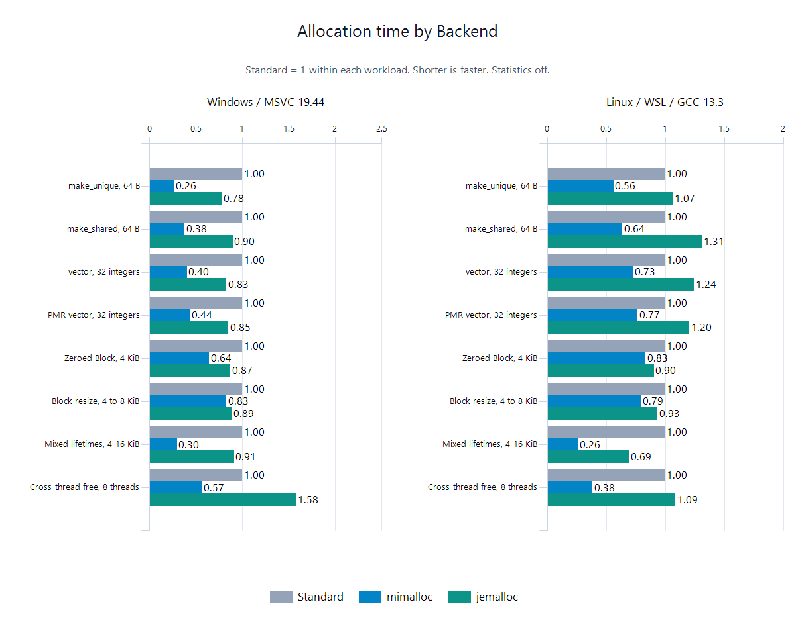

# UniMemory

[](https://github.com/dugan-dev/UniMemory/actions/workflows/ci.yml) [](https://github.com/dugan-dev/UniMemory/tree/main) [](LICENSE) [](https://isocpp.org/std/the-standard) [](https://cmake.org/) [](docs/guides/backends.zh-CN.md)

现代 C++20 内存分配库，为 Standard、mimalloc 和 jemalloc 提供统一接口。

[English](README.md) · **简体中文**

<details>
<summary>目录</summary>

- [特点](#特点)
- [快速开始](#快速开始)
- [平台](#平台) · [功能](#功能)
- [性能](#性能)
- [构建与安装](#构建与安装) · [项目集成](#项目集成)
- [文档](#文档) · [许可证](#许可证)

</details>

## 特点

- **🚀 现代 C++20**：类型化构造，与标准库集成。
- **🔄 统一后端**：一套 API 使用 Standard、mimalloc 和 jemalloc。
- **🧱 对象与数组**：创建、销毁对象和数组，构造失败时清理资源。
- **🔒 智能指针**：创建独占、共享智能指针，支持接管已有对象。
- **📦 标准容器**：通过 Allocator 和 PMR 接入标准库容器。
- **🎯 对齐内存**：自定义对齐、清零分配与 Buffer 扩容。
- **🗂️ 独立堆与栈式分配**：独立管理分配组，支持固定缓冲区的临时分配。
- **📊 可选统计**：分配请求计数，以及可用的后端原生指标。
- **🌐 跨平台**：支持 Windows、Linux、macOS。

## 快速开始

### 基本用法

```cpp
#include <unimem/memory.h>

int main() {
    // 获取全局分配器，后端可选 Standard、Mimalloc、Jemalloc
    unimem::Memory& memory = unimem::Memory::global(unimem::Backend::Standard);

    // 普通分配与释放
    void* bytes = memory.allocate(1024);
    memory.deallocate(bytes, 1024);

    // 清零分配与释放
    void* zeroed = memory.allocate_zeroed(1024);
    memory.deallocate(zeroed, 1024);

    // 对齐分配与释放
    void* aligned = memory.allocate(1024, 64);
    memory.deallocate(aligned, 1024, 64);

    // 重分配，按新大小释放
    void* resized = memory.allocate(1024);
    resized = memory.reallocate(resized, 1024, 2048);
    memory.deallocate(resized, 2048);

    // 扩容并清零新增字节
    void* grown = memory.allocate_zeroed(2048);
    grown = memory.reallocate_zeroed(grown, 2048, 4096);
    memory.deallocate(grown, 4096);

    return 0;
}
```

### 对象

```cpp
struct Point {
    float x;
    float y;
};

// 创建与销毁对象
Point* point = memory.create<Point>(1.0f, 2.0f);
memory.destroy(point);

// 按类型分配存储空间，访问元素前需先构造
Point* storage = memory.allocate_objects<Point>();
memory.deallocate_objects(storage);

// 创建与销毁数组
Point* array = memory.create_array<Point>(8);
memory.destroy_array(array, 8);
```

### 内存块

```cpp
// 创建自动管理的内存块，按 64 字节对齐
unimem::OwnedBlock block = memory.make_block(1024, 64);

// 获取数据、大小与对齐
void* data = block.data();
std::size_t bytes = block.size();
std::size_t alignment = block.alignment();

// 调整大小，数据指针可能变化
block.resize(2048);

// 转移所有权
unimem::OwnedBlock moved = std::move(block);
```

### 标准容器

```cpp
#include <list>
#include <memory_resource>
#include <string>
#include <unordered_map>
#include <vector>

// 使用标准分配器
std::vector<Point, unimem::Allocator<Point>> positions(memory.allocator<Point>());
positions.emplace_back(1.0f, 2.0f);

std::list<Point, unimem::Allocator<Point>> path(memory.allocator<Point>());

// 使用标准 PMR 容器
std::pmr::vector<Point> points(memory.resource());
points.emplace_back(3.0f, 4.0f);
points.resize(8);

std::pmr::string text("Hello", memory.resource());
std::pmr::unordered_map<int, Point> lookup(memory.resource());
```

### 智能指针

```cpp
// 创建独占智能指针
unimem::Unique<Point> owner = memory.make_unique<Point>(1.0f, 2.0f);

// 创建共享智能指针
std::shared_ptr<Point> shared = memory.make_shared<Point>(3.0f, 4.0f);

// 接管同一个 Memory 创建的对象
Point* point = memory.create<Point>(5.0f, 6.0f);
unimem::Unique<Point> adopted = memory.adopt_unique(point);

// 兼容标准弱指针
std::weak_ptr<Point> weak = shared;

// 创建智能数组指针
unimem::UniqueArray<Point> owned = memory.make_unique_array<Point>(16);
```

### 堆

```cpp
const unimem::Backend backend = unimem::Backend::Mimalloc;

// 支持时创建堆
if (unimem::available(backend) && unimem::capabilities(backend).heap) {
    unimem::Memory heap = unimem::Memory::heap(backend);

    // 检查归属并释放
    void* bytes = heap.allocate(1024);
    bool owned = heap.owns(bytes);
    heap.deallocate(bytes, 1024);

    // 回收时暂停该堆上的其他操作
    heap.collect();

    // 先销毁已创建的对象；reset 只回收存储，原指针失效
    void* batch = heap.allocate(1024);
    heap.reset();
}
```

### 栈

```cpp
// 先声明缓冲区，再创建 scratch；仅供当前线程使用
alignas(std::max_align_t) std::byte buffer[4096];
unimem::Memory scratch = unimem::Memory::stack(buffer);

// 标记并分配
unimem::Memory::Mark checkpoint = scratch.mark();
void* bytes = scratch.allocate(128);

// 若创建了对象，先 destroy；rewind 只回收存储，旧指针和标记失效
scratch.rewind(checkpoint);

std::size_t used = scratch.used();
std::size_t capacity = scratch.capacity();

// 重置缓冲区
scratch.reset();
```

### 初始化与统计

```cpp
#include <vector>

const unimem::Backend backends[] = {
    unimem::Backend::Standard,
    unimem::Backend::Mimalloc,
    unimem::Backend::Jemalloc
};

// 保存可用的 Memory
std::vector<unimem::Memory*> memories;

for (unimem::Backend backend : backends) {
    // 跳过未启用的后端
    if (!unimem::available(backend)) {
        continue;
    }

    // 首次获取前启用统计
    unimem::Memory::configure_global(backend, unimem::StatisticsMode::Basic);
    memories.push_back(&unimem::Memory::global(backend));
}

// 使用保存的 Memory，并查询统计
for (unimem::Memory* memory : memories) {
    unimem::OwnedBlock block = memory->make_block(1024);

    // 查询请求次数与字节数
    std::optional<unimem::MemoryStatistics> stats = memory->statistics();
    if (stats) {
        std::uint64_t live = stats->live_bytes;
        std::uint64_t peak = stats->peak_live_bytes;
        std::uint64_t calls = stats->allocations;
    }

    // 原生统计字段可能不可用
    std::optional<unimem::BackendStatistics> details = memory->backend_statistics();
    if (details && details->committed_bytes) {
        std::uint64_t committed = *details->committed_bytes;
        unimem::BackendStatisticsScope scope = details->scope;
    }
}
```

### 运行时选项

```cpp
const unimem::Backend backend = unimem::Backend::Mimalloc;
const unimem::RuntimeOption option = unimem::RuntimeOption::UnusedPageReleaseDelayMs;

// 正常分配前设置后端级选项
if (unimem::supports(backend, option)) {
    // 将闲置页释放延迟设为 1000 毫秒
    bool configured = unimem::set_runtime_option(backend, option, 1000);
}
```

## 平台

| 平台 | Standard | mimalloc | jemalloc | 编译器 |
| --- | :---: | :---: | :---: | --- |
| Windows x64 | ✔ | ✔ | ✔ | MSVC |
| Linux x64 | ✔ | ✔ | ✔ | GCC |
| macOS | ✔ | ✔ | ✔ | Apple Clang |
| Android / iOS | — | — | — | 尚未设备验证 |

✔ 已支持；— 尚未设备验证。[平台说明](docs/guides/backends.zh-CN.md)

## 功能

| 功能 | Standard | mimalloc | jemalloc |
| --- | :---: | :---: | :---: |
| 对象、容器、内存块 | ✔ | ✔ | ✔ |
| 分配统计 | ✔ | ✔ | ✔ |
| 独立堆 | — | ✔ | ✔ |
| 原生统计范围 | — | 进程 | 进程 / 独立堆，取决于构建 |
| 闲置内存释放延迟 | — | ✔ | ✔ |
| 额外依赖 | 无 | 可选 | 可选 |

Standard 无需额外依赖；mimalloc、jemalloc 按需启用。[配置指南](docs/guides/backends.zh-CN.md)

## 性能

Windows x64 · MSVC 19.44 · 统计关闭 · 2026-09-28。单位 **ns/次，越小越快**。

| 操作 | Standard | mimalloc | jemalloc |
| --- | ---: | ---: | ---: |
| 创建并销毁对象，64 B | 46.4 | 12.2 | 36.0 |
| vector 增长并销毁，32 个整数 | 590.3 | 237.4 | 488.5 |
| 分配、扩容、释放，4 → 8 KiB | 168.5 | 139.8 | 149.4 |
| 单线程分配，8 个线程释放 | 105.4 | 59.8 | 166.6 |



图中 Standard = 1，条形越短越快。[完整测量报告](docs/performance.zh-CN.md)

## 构建与安装

需要 **C++20** 和 **CMake 3.25+**。下载[源码](https://github.com/dugan-dev/UniMemory/archive/refs/heads/main.zip)，解压后在源码目录执行：

```sh
cmake --preset release -DUNIMEMORY_BUILD_TESTS=OFF -DUNIMEMORY_BUILD_EXAMPLES=ON
cmake --build --preset release
cmake --install build/UniMemory-release --config Release --prefix build/installed
```

库安装至 `build/installed`。[构建选项](docs/getting-started.zh-CN.md#构建选项)

## 项目集成

在项目的 `CMakeLists.txt` 中链接 UniMemory：

```cmake
cmake_minimum_required(VERSION 3.25)
project(MyApp LANGUAGES CXX)

find_package(UniMemory 0.0.1 CONFIG REQUIRED)
add_executable(app main.cpp)
target_link_libraries(app PRIVATE UniMemory::UniMemory)
```

配置项目时，用 `-DCMAKE_PREFIX_PATH=<安装目录的绝对路径>` 指定安装位置。源码集成可用 `add_subdirectory(UniMemory)` 替代 `find_package(...)`。[集成指南](docs/getting-started.zh-CN.md)

## 文档

- **开始使用：** [构建与安装](docs/getting-started.zh-CN.md) · [可运行示例](examples/README.md)
- **日常使用：** [对象与数组](docs/guides/objects.zh-CN.md) · [标准容器](docs/guides/containers.zh-CN.md) · [内存块](docs/guides/raw-memory.zh-CN.md)
- **内存管理：** [堆](docs/guides/heap.zh-CN.md) · [栈](docs/guides/stack.zh-CN.md) · [统计](docs/guides/statistics.zh-CN.md)
- **参考：** [API](docs/api-reference.zh-CN.md) · [后端配置](docs/guides/backends.zh-CN.md) · [完整目录](docs/README.zh-CN.md)

## 许可证

[MIT](LICENSE)。可选分配器遵循各自的许可证。
