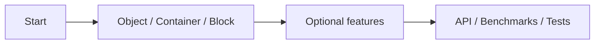

# Documentation

[UniMemory](../README.md) · **English** · [简体中文](README.zh-CN.md)

Documentation covers basic allocation, optional features, API contracts and validation results.

## 1 · Start

| Topic | Purpose |
| --- | --- |
| [Build and install](getting-started.md) | Library build and project integration |
| [API overview](api-reference.md#1--create-memory) | Global, Heap and Stack creation |

## 2 · Everyday use

| Topic | Purpose |
| --- | --- |
| [Object / Array](guides/objects.md) | Construction, destruction, ownership |
| [Container](guides/containers.md) | Standard containers and PMR |
| [Block](guides/raw-memory.md) | Alignment, resize, automatic release |

## 3 · Optional features

| Topic | Purpose |
| --- | --- |
| [Backend](guides/backends.md) | Configuration, platforms, dependencies |
| [Heap](guides/heap.md) | Manage an independent allocation group |
| [Stack](guides/stack.md) | Temporary storage in a caller-provided fixed buffer |
| [Statistics](guides/statistics.md) | Request counts and backend details |
| [Runtime options](guides/runtime-options.md) | Configure unused-page release delay |

## 4 · Reference

| Topic | Purpose |
| --- | --- |
| [API](api-reference.md) | Signatures and contracts |
| [Compatibility](compatibility.md) | Lifetime, threads, allocation pairing |
| [Performance](performance.md) | Time, memory, native programs |
| [Tests](testing.md) | Test scope and results |

## Further reading

[Examples](../examples/README.md) · [Benchmark method](benchmarking.md) · [Raw data](results/0.0.1/README.md) · [Upstream tests](upstream-validation.md)

[Capability comparison](allocator-capabilities.md) · [mimalloc](backends/mimalloc.md) · [jemalloc](backends/jemalloc.md) · [TCMalloc](backends/tcmalloc.md)
