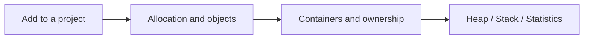

# Documentation

[UniMemory](../README.md) · **English** · [简体中文](README.zh-CN.md)

The [Quick Start](../README.md#quick-start) shows common APIs. Choose a topic below for setup, usage and requirements.

## 1 · Get started

| Topic | Content |
| --- | --- |
| [Build and install](getting-started.md) | CMake integration and deployment |
| [Platforms and backends](guides/backends.md) | Platform support and optional backends |
| [Runnable examples](../examples/README.md) | Complete programs |

## 2 · Everyday use

| Topic | Content |
| --- | --- |
| [Raw memory](guides/raw-memory.md) | Allocate, free, align and resize |
| [Objects and arrays](guides/objects.md) | Construction, destruction and smart pointers |
| [Blocks](guides/raw-memory.md#resize-and-ownership) | Automatic release and resizing |
| [Containers](guides/containers.md) | Allocator, PMR and nested containers |

## 3 · Memory management

| Topic | Content |
| --- | --- |
| [Heap](guides/heap.md) | Independent groups and bulk release |
| [Stack](guides/stack.md) | Fixed buffers, marks and rewind |
| [Statistics](guides/statistics.md) | Usage, peaks and query scopes |
| [Runtime options](guides/runtime-options.md) | Unused-memory release delay |

## 4 · Reference

| Topic | Content |
| --- | --- |
| [API](api-reference.md) | Functions, parameters and return values |
| [Lifetime and threads](compatibility.md) | Ownership, concurrency and shared libraries |
| [Performance](performance.md) | Time and memory comparisons |
| [Test results](testing.md) | Verified platforms and coverage |

[Backend capabilities](allocator-capabilities.md) · [Measurement method](benchmarking.md) · [Raw data](results/0.0.1/README.md) · [Upstream validation](upstream-validation.md)
