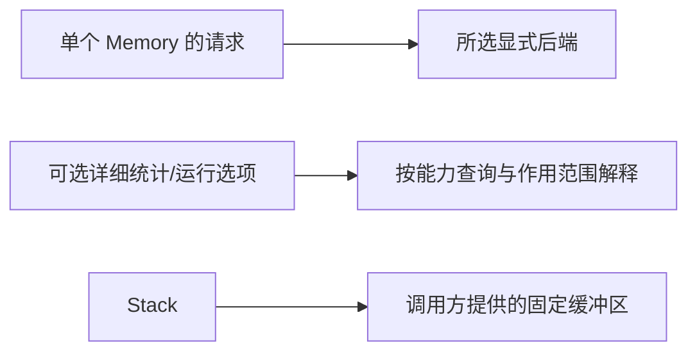

# 能力对照：统一到哪里

[English](allocator-capabilities.md) · **简体中文**
[文档目录](README.zh-CN.md) / 查阅 · 先看[Backend 选择指南](guides/backends.zh-CN.md)。

UniMemory 统一**业务常用的分配、所有权、分配范围、诊断和可选调优接口**。能力查询会暴露支持状态；不把不同 Backend 的物理行为说成完全相同。

| 能力 | mimalloc | jemalloc | Google TCMalloc | UniMemory 决定 |
| --- | --- | --- | --- | --- |
| 基础与对齐分配 | `mi_malloc`、对齐函数 | `mallocx`、`MALLOCX_ALIGN` | 进程 `malloc/new`、对齐形式 | `Memory::allocate/deallocate`；可显式选前两者 |
| 清零分配/扩容 | `mi_zalloc`、`mi_rezalloc` | `MALLOCX_ZERO` | `calloc`；普通 `realloc` 不清零增长 | `allocate_zeroed`、统一语义的 `reallocate_zeroed` |
| Object 与 Container | C++ 包装与宏 | 标准分配器 | 全局 `new` 替换 | `create/destroy`、Smart Pointer、`Allocator<T>`、PMR |
| 已知大小的快速路径 | `mi_free_csize` | `sdallocx` | sized delete 等 | 底层释放保留大小；优化要依据基准 |
| 独立 Heap | heap、OS arena、subprocess | arena、线程缓存 | 进程级分配器和缓存 | `Memory::heap()` 支持 mimalloc / jemalloc；Standard 不支持 |
| 统计与遍历 | 原生统计、块遍历；仅映射可靠 Process 页指标 | `mallctl`、profile；可映射 Heap 指标 | `MallocExtension`、采样 | Basic 请求计数 + 可选原生指标；不提供块遍历或画像 |
| 调参与回收 | 收集、运行时选项 | purge/decay、`mallctl` | 进程释放与缓存限制 | 可选回收延迟；Heap 的 `collect()` 回收闲置资源 |
| 临时栈式分配 | 无对应语义 | 无对应语义 | 无对应语义 | `Memory::stack()` 管理调用方 Buffer |
| 全局替换 | 构建/链接方式 | 构建/链接方式 | 最终程序链接 | 不属于逐实例 `Memory` |

## 三种范围

| 名词 | 在本库中的准确含义 |
| --- | --- |
| **请求字节** | 传给某个 `Memory` 的大小；不等于可用容量、已提交页或进程 RSS |
| **Heap** | `Memory::heap()` 创建；动态增长，不保证连续或物理隔离 |
| **mimalloc heap** | 独立 Heap 的内部实现；`Memory::global(Backend::Mimalloc)` 使用默认分配接口；OS arena 是另一层大型内存区域 |
| **jemalloc arena** | 独立 Heap 的内部实现；`Memory::global(Backend::Jemalloc)` 使用共享路径 |
| **Google TCMalloc** | 最终程序选择的进程级分配路径，不可逐个 `Memory` 切换 |
| **Stack Memory** | 固定缓冲区上的线性回退；不是线程调用栈，也不析构 C++ Object |

## 证据与版本

已验证 mimalloc **3.4.3**、jemalloc **5.3.1**，以及固定修订的 Google TCMalloc。官方网页可能描述更新版本，不代表已验证版本支持所有新接口。[构建条件](guides/backends.zh-CN.md) · [测试结果](testing.zh-CN.md)

按 Backend 查完整功能族：[mimalloc](backends/mimalloc.zh-CN.md) · [jemalloc](backends/jemalloc.zh-CN.md) · [TCMalloc](backends/tcmalloc.zh-CN.md)。
