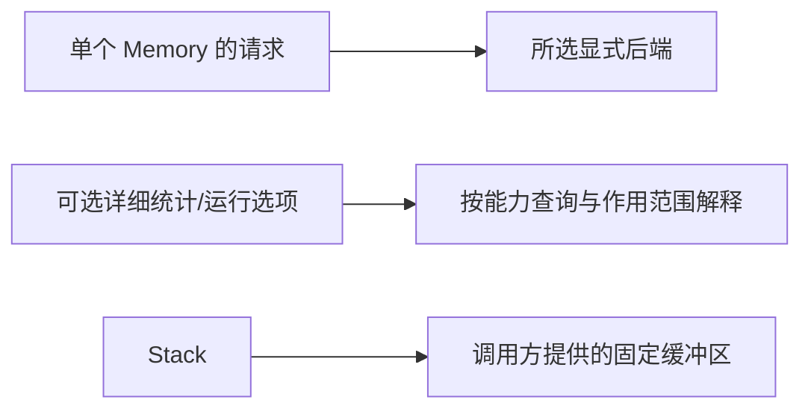

# 后端能力对照

[目录](README.zh-CN.md) · [English](allocator-capabilities.md) · **简体中文**

后端配置见[平台与后端](guides/backends.zh-CN.md)。

UniMemory 统一**业务常用的分配、所有权、分配范围、诊断和可选调优接口**。能力查询会暴露支持状态；不把不同 Backend 的物理行为说成完全相同。

| 能力 | Standard C++ | mimalloc | jemalloc | UniMemory 接口 |
| --- | --- | --- | --- | --- |
| 基础与对齐分配 | `new/delete`、对齐形式 | `mi_malloc`、对齐函数 | `mallocx`、`MALLOCX_ALIGN` | `allocate/deallocate` |
| 清零分配/扩容 | 手动分配、复制、清零 | `mi_zalloc`、`mi_rezalloc` | `MALLOCX_ZERO` | `allocate_zeroed`、`reallocate_zeroed` |
| Object 与 Container | 标准分配器、PMR | C++ 包装与宏 | 可提供底层存储 | `create/destroy`、Smart Pointer、`Allocator<T>`、PMR |
| 已知大小的释放 | sized delete | `mi_free_csize` | `sdallocx` | 释放接口保留大小，不承诺专用快速路径 |
| 独立 Heap | 无对应统一接口 | heap | arena | `Memory::heap()`，仅支持 mimalloc / jemalloc |
| 详细统计 | 无分配器内部指标 | 原生 Process 指标 | `mallctl`，Process / Heap 指标 | Basic 请求计数、可选原生指标与明确统计范围 |
| 调参与回收 | 无对应控制接口 | 收集、运行时选项 | purge/decay、`mallctl` | 可选回收延迟、Heap 的 `collect()` |
| 临时栈式分配 | 调用方提供缓冲区 | 无对应语义 | 无对应语义 | `Memory::stack()` |
| 分配画像与块遍历 | 无共同接口 | 原生专属功能 | 原生专属功能 | 0.0.1 不提供 |

## 三种范围

| 名词 | 在本库中的准确含义 |
| --- | --- |
| **请求字节** | 传给某个 `Memory` 的大小；不等于可用容量、已提交页或进程 RSS |
| **Heap** | `Memory::heap()` 创建；动态增长，不保证连续或物理隔离 |
| **mimalloc heap** | 独立 Heap 的内部实现；`Memory::global(Backend::Mimalloc)` 使用默认分配接口；OS arena 是另一层大型内存区域 |
| **jemalloc arena** | 独立 Heap 的内部实现；`Memory::global(Backend::Jemalloc)` 使用共享路径 |
| **Stack Memory** | 固定缓冲区上的线性回退；不是线程调用栈，也不析构 C++ Object |

## 证据与版本

已验证 mimalloc **3.4.3**、jemalloc **5.3.1**。官方网页可能描述更新版本，不代表已验证版本支持所有新接口。[构建条件](guides/backends.zh-CN.md) · [测试结果](testing.zh-CN.md)

按 Backend 查完整功能族：[mimalloc](backends/mimalloc.zh-CN.md) · [jemalloc](backends/jemalloc.zh-CN.md)。
