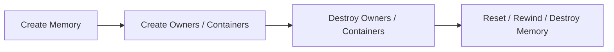

# Lifetime and compatibility

[Index](README.md) · **English** · [简体中文](compatibility.zh-CN.md)

## Lifetime

| Kind | Rule |
| --- | --- |
| Global | Library-managed; available during static destruction. Never delete or explicitly destroy it. |
| Heap | Destroy Owners, Containers and weak_ptr control blocks before reset or destruction. |
| Stack | Buffer outlives Memory. Destroy affected Owners and Containers before rewind/reset. |

Global and Heap allow concurrent allocation/free. Synchronize Object access separately. Reset, collection and destruction require exclusive access; Stack is single-threaded.

| Access | Synchronization |
| --- | --- |
| Different allocations through Global / Heap | Allocation/free may run concurrently |
| Basic statistics snapshots | Atomic counters; fields may describe different instants |
| Backend diagnostic statistics | Pause activity and thread cleanup in its Memory/Process scope, including native calls |
| Same Object, OwnedBlock or Container | Caller coordinates readers and writers |
| Separate shared_ptr / weak_ptr handles | Standard control-block synchronization; Object data is separate |
| Same shared_ptr handle being modified | Caller synchronization, or the standard atomic shared_ptr interface |
| Publish ownership to another thread | Mutex, barrier or release/acquire publication; no unsynchronized pointer handoff |
| Heap collect/reset/destruction | No concurrent Memory operations or access to reclaimed storage |

## Allocation pairing

Release through the original Memory, using the current request size and original alignment. Do not mix UniMemory storage with delete, free or another Heap. Smart Pointers and OwnedBlock remember the allocation context; raw pointers do not.

Raw Object destruction also requires its original concrete type and allocation-start
pointer. Adoption binds this Memory without inspecting arbitrary pointer provenance.

Reset/rewind reclaim storage without running Object destructors. Stale pointers, live Containers and remaining weak_ptr control blocks must not access reclaimed storage.

## Dynamic libraries

Global identity is per linked copy of UniMemory. Separate static copies in dynamic libraries can have separate instances; use one shared library for shared identity and counters. Cross-library C++ Objects and Containers require compatible compiler, standard library and runtime ABIs.

Keep the library loaded while its Memory instances, owners, Allocators or PMR resources are in use.

## Standard library behavior

`make_shared<T>()` delegates to `std::allocate_shared`; its Object and control
block follow the selected standard library. On the tested libstdc++ 13.3,
`make_shared<T[]>(count)` destroys partially constructed elements in forward order
when an element constructor throws. Native `std::make_shared` reproduces this
deviation from the C++20 reverse-order requirement
([LWG 3005](https://cplusplus.github.io/LWG/issue3005)). All constructed elements
are destroyed and storage is released according to the Memory kind.

Use `create_array` or `make_unique_array` when reverse-order rollback is required. A fixed standard-library version has not been verified.

## Version

Version **0.0.1** uses C++20. 0.x does not promise a stable ABI; distribute matching headers and libraries, and rebuild consumers when their layout changes.
