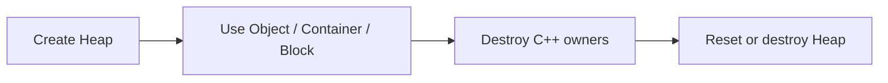

# Independent Heap

[Index](../README.md) · **English** · [简体中文](heap.zh-CN.md)

## Create and use

```cpp
#include <unimem/memory.h>

struct Point { float x; float y; };
unimem::Memory heap = unimem::Memory::heap(unimem::Backend::Mimalloc);
{
    unimem::Unique<Point> point = heap.make_unique<Point>(1.0f, 2.0f);
    heap.collect();
}
heap.reset();
```

Enable the Backend at build time. `capabilities(backend).heap` reports support.
Standard does not provide independent Heap support. All common Memory methods are available.

## Operations

| Member | Purpose |
| --- | --- |
| `reset()` | Release every block and start a new Basic statistics epoch |
| `collect()` | Attempt to reclaim unused native resources; preserve live allocations |
| `owns(ptr)` | Determine whether a live allocation belongs to this Heap |
| `statistics()` | Optional counters for this Heap |
| `backend_statistics()` | Optional native metrics; currently jemalloc with `config.stats` |

Memory destruction releases remaining Heap blocks. Neither destruction nor reset
runs Object destructors. Destroy Owners, Containers and weak-pointer control blocks first.
Reset failure preserves the previous allocations. Collection, reset and Memory
destruction require exclusive access. Concurrent allocation/free is supported;
Object access and ownership handoff need their own synchronization.

`owns(nullptr)` is false. Other pointers must be live allocation starts from the
same Backend; this is not a validator for arbitrary or dangling addresses.
Collection does not guarantee an immediate process-memory decrease or that every
thread's cache is drained.



Native mappings: mimalloc Heap; jemalloc explicit arena with tcache disabled.
The Heap grows dynamically and does not promise contiguous allocations.

Next: [Stack](stack.md) · [Statistics](statistics.md)
