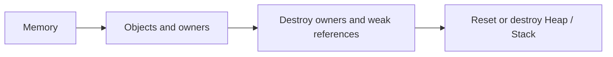

# Objects and ownership

[Index](../README.md) · **English** · [简体中文](objects.zh-CN.md)

Examples: [Quick Start](../../README.md#quick-start).

## Construction and cleanup

| Case | Contract |
| --- | --- |
| Object construction | Arguments are forwarded to the constructor |
| Array construction | Elements are value-initialized with `T()` |
| `create_array()` constructor throws | Destroy completed elements in reverse order, then release storage |
| Destructor | Object helpers require a non-throwing destructor |
| Manual destruction | Use the same Memory, exact concrete type and original array count |
| Typed storage | `allocate_objects<T>()` supplies array storage without calling element constructors or initializing their values |

Keep the allocation-start pointer. An object created as Derived must not be passed to `destroy(Base*)`, even with a virtual destructor. Ordinary `new`/`delete` are not interchangeable with these helpers. Raw `reallocate()` does not move-construct objects.

## Adoption and polymorphism

| Operation | Rule |
| --- | --- |
| `adopt_unique()` / `adopt_unique_array()` | Adopt an allocation created by the same Memory, or released from a matching owner |
| Adoption | Transfers responsibility; does not allocate or construct |
| Empty Unique | Valid; assign a bound owner before giving it an object |
| Nonempty unbound Deleter | Terminates; it has no Memory to use for cleanup |
| Array `reset(new_pointer)` | Retains the old element count; assign a newly adopted array when the count changes |
| Polymorphic shared ownership | Converting `make_shared<Derived>()` to `shared_ptr<Base>` retains concrete-type cleanup |
| Polymorphic unique ownership | Keep `Unique<Derived>`; use `Base*` only as a non-owning view |

## Lifetime

Owners retain a Memory reference. Destroy them before their Heap/Stack Memory, and before reset or rewind invalidates their storage. Remaining `weak_ptr` objects also retain a shared-pointer control block.

On Stack, a failed constructor destroys completed objects but retains consumed buffer space. Rewind only after all affected owners are gone.

Typed allocation and `Allocator<T>::allocate()` establish array storage under C++20, including after Stack reuse. Construct nontrivial elements before accessing them, for example with `std::construct_at`. [Lifetime rationale and verification limits](../typed-storage-lifetime.md).

[Container contracts](containers.md) · [Lifetime and threads](../compatibility.md) · [API](../api-reference.md)
