# Performance report

[UniMemory](../README.md) · **English** · [简体中文](performance.zh-CN.md)

## Current remote reports

Compare Standard, mimalloc and jemalloc native allocation with UniMemory. Three fresh-process trials; medians shown. Compare each platform separately.

| Legend | Meaning |
| --- | --- |
| Native | Direct allocator calls |
| UniMemory | Unified interface, statistics disabled |
| API + stats | Unified interface, Basic statistics enabled |

Throughput charts record logical CPU capacity; thread counts above it include oversubscription. Each chart identifies its platform and measured revision.

## 1 · Throughput

**Allocation/free pairs per second as thread count increases; higher is better.** A 64-byte cross-thread release workload.

### Linux x64

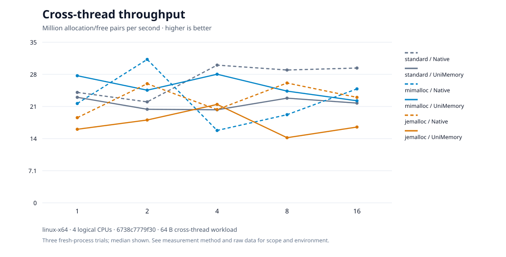

### Windows x64

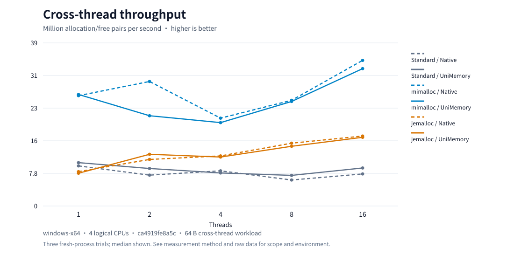

### macOS ARM64

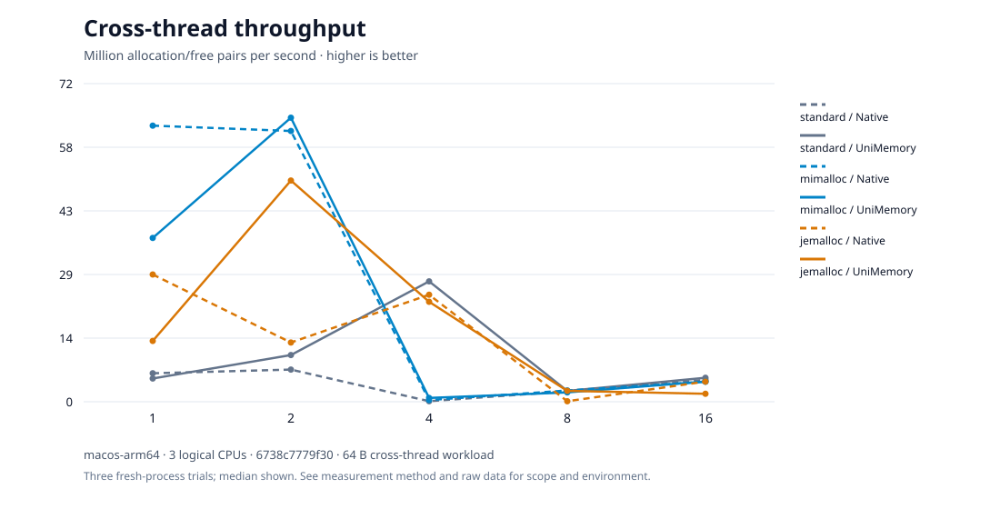

## 2 · Peak memory

**Resident memory under the same workload; lower is better.** Includes thread stacks, process and allocator state.

### Linux x64

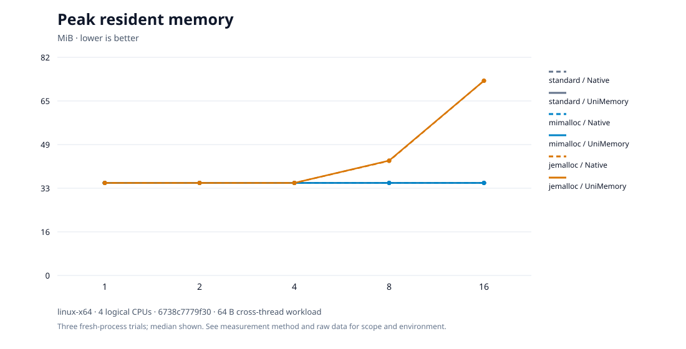

### Windows x64

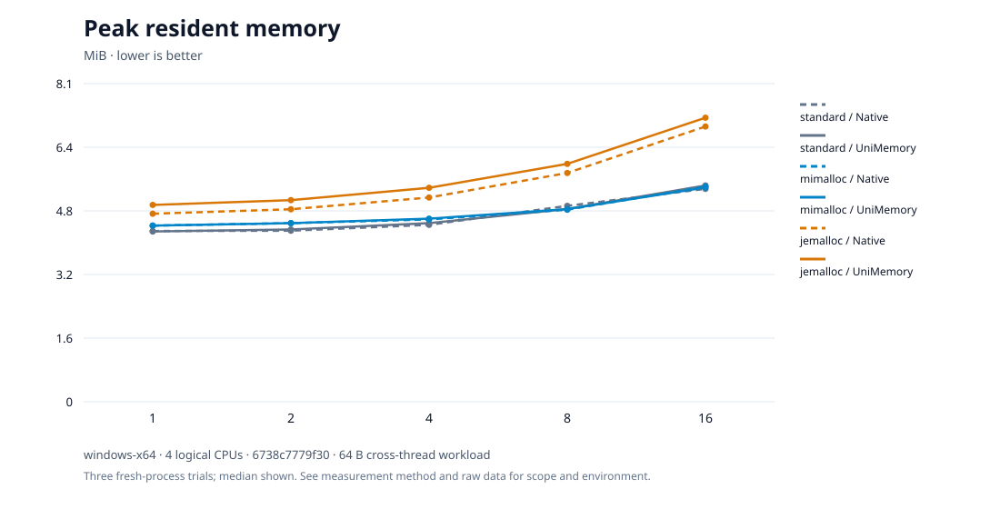

### macOS ARM64

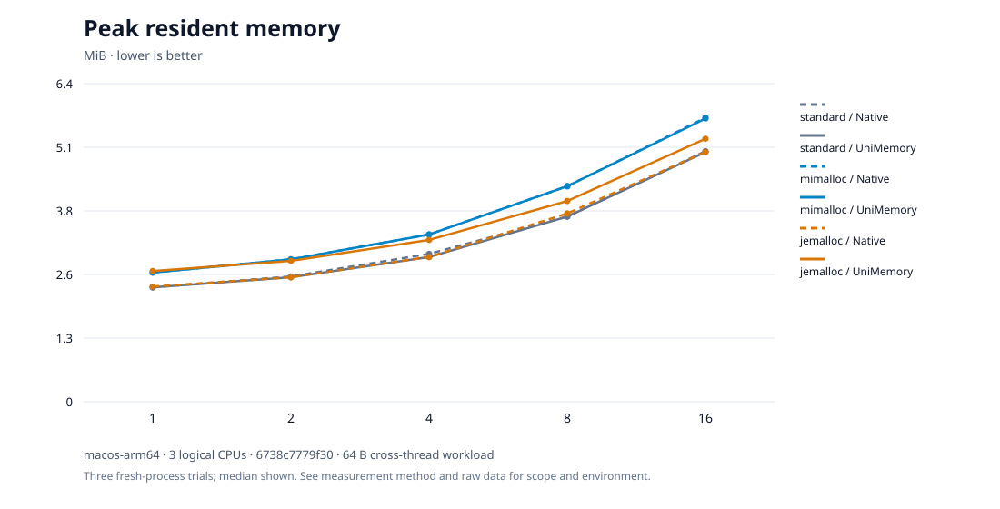

## 3 · Tail latency

**Slow allocation requests at each size; lower is better.** P99 means 99% of samples are at or below this latency; clock overhead is included.

### Linux x64

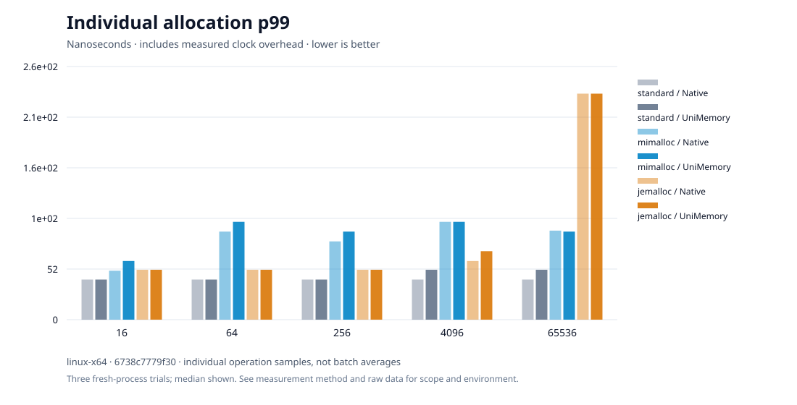

### Windows x64

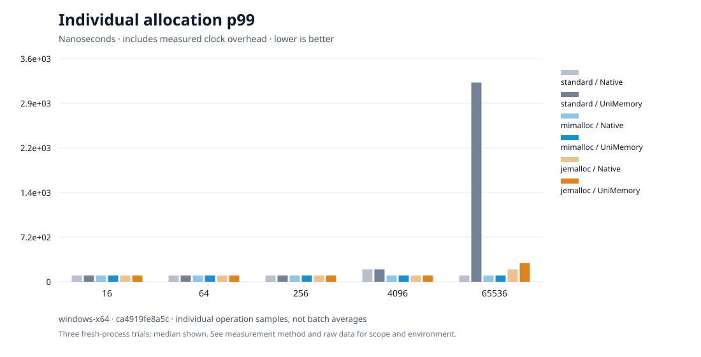

### macOS ARM64

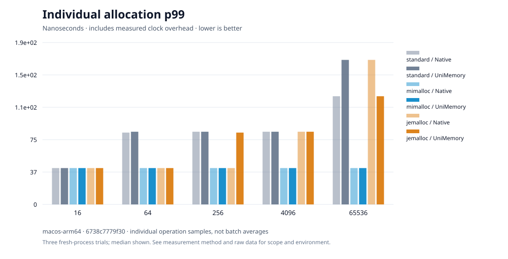

## 4 · Statistics cost

**Additional latency with counters enabled.** Compare within the same backend and size; patterned columns enable statistics.

### Linux x64

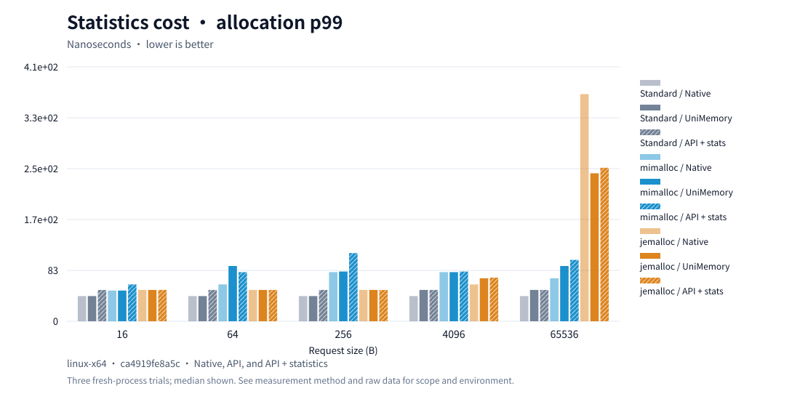

### Windows x64

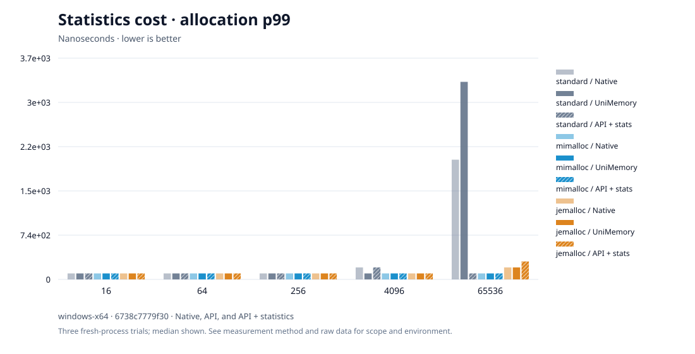

### macOS ARM64

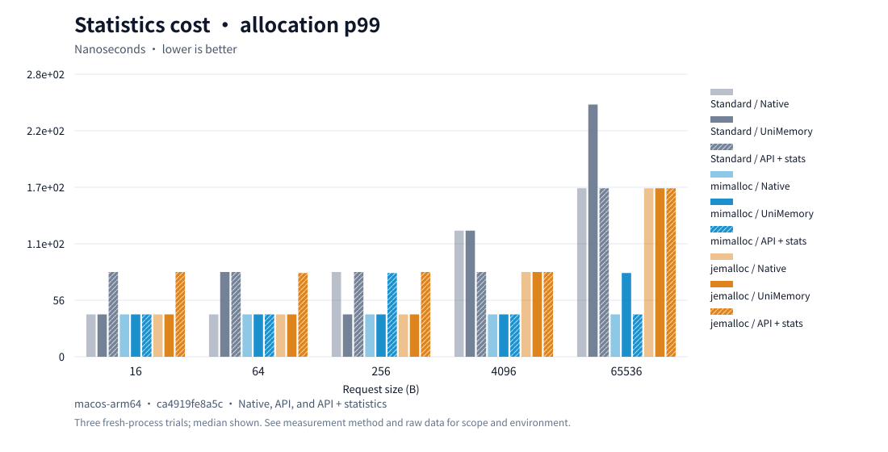

## 5 · Memory after release

**Memory across allocation, survival and release cycles.** The final phase has no live requests; retained resident memory may be cache, not a leak.

### Linux x64

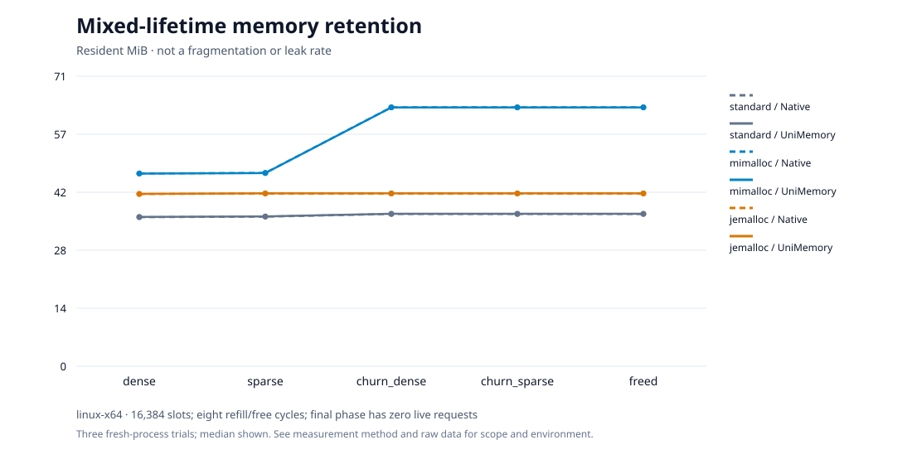

### Windows x64

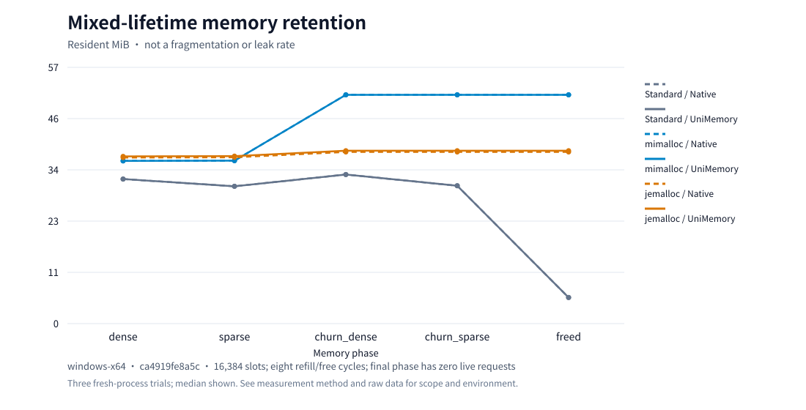

### macOS ARM64

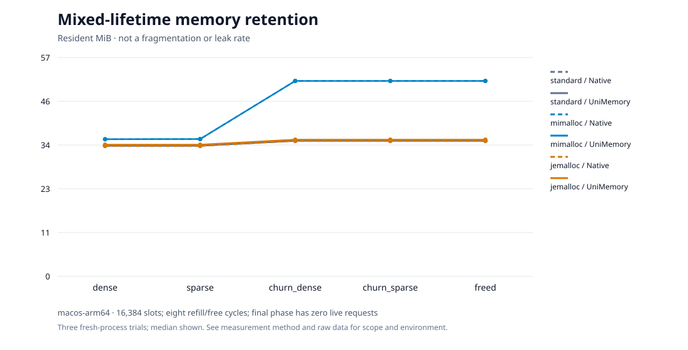

## 6 · Common operations

**Relative time for objects, resizing and containers; lower is better.** Standard equals 1 within each group; different operations have different costs.

### Linux x64

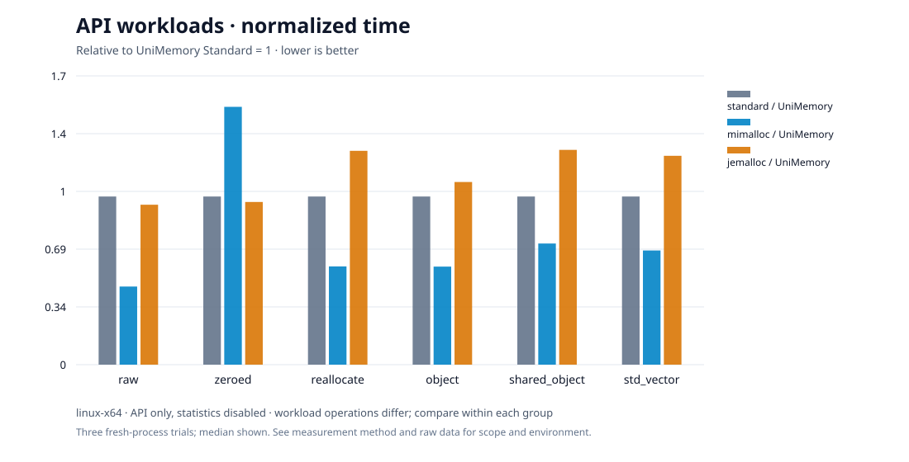

### Windows x64

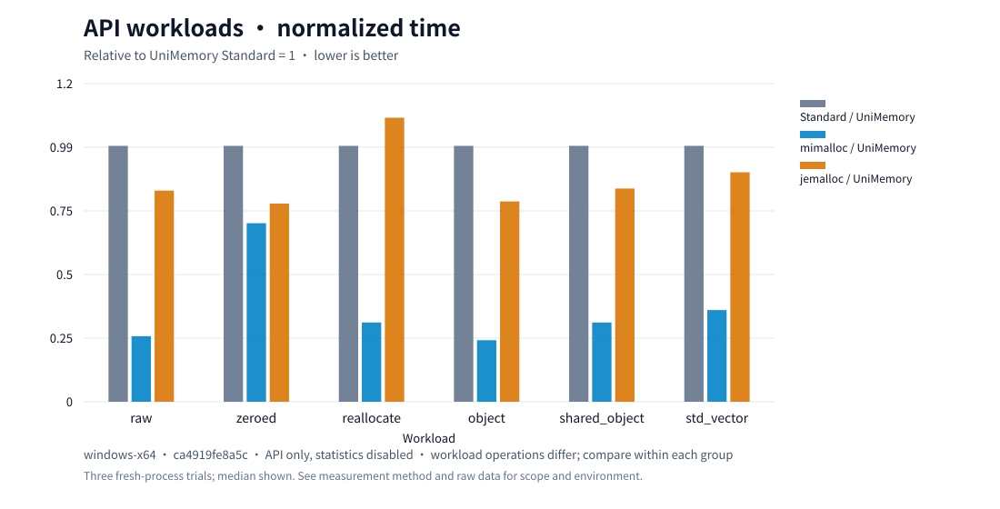

### macOS ARM64

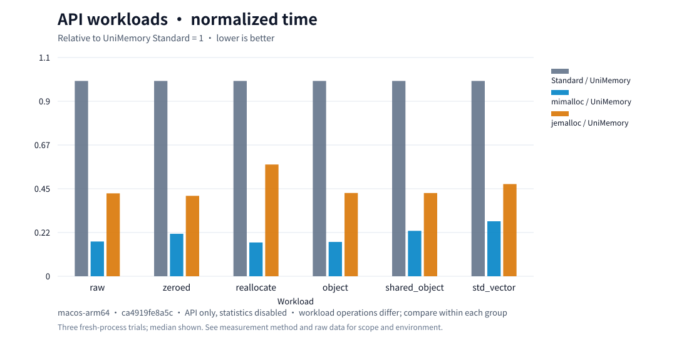

## Historical report · 2026-09-28

The original Windows/Linux workload comparison is preserved. Standard equals 1; shorter bars are faster. Its environment differs from the current remote reports.

[Historical time](performance/latency.md) · [Historical memory](performance/memory.md) · [Native applications](performance/applications.md)

## Data and method

[Current CSV and environment](results/current/) · [Historical data](results/0.0.1/README.md) · [Measurement method](benchmarking.md)

Source changes automatically update the figures. Individual samples remain in Actions artifacts for 14 days; aggregate data stays in the repository. Small hosted-machine variations are not absolute speed gates. These measurements do not establish long-term fragmentation, NUMA or mobile performance.
