# 性能报告

[UniMemory](../README.zh-CN.md) · [English](performance.md) · **简体中文**

## 纯头文件控制 · 2026-10-11

[Windows完整23组控制](performance/header-only.zh-CN.md)列出默认、IPO、`/Ob3`的 SDK/API绝对时间、Global shared请求大小及尚未解决的云端限制。

## 当前远程报告

这些图表保留各自记录的源码修订与协议，早于当前纯头文件固定配置；不把旧结果作为新配置的性能保证。不同后端与 ON/OFF 现在分别构建，比较需匹配 SDK、编译选项和计时条件。

对比 Standard、mimalloc、jemalloc 的原生接口与 UniMemory 封装。三轮独立进程测量，取中位数；不同平台分别比较。

| 图例 | 含义 |
| --- | --- |
| 原生接口 | 直接调用分配器 |
| UniMemory 封装 | 统一接口，关闭统计 |
| 封装＋统计 | 统一接口，开启 Basic 统计 |

吞吐量图标注逻辑 CPU 数；超过该数量的线程包含超额调度开销。每张图标注平台和测量修订。

## 1 · 吞吐量

**看线程增加后每秒能完成多少组分配/释放，越高越好。** 负载为 64 字节跨线程释放。

### Linux x64

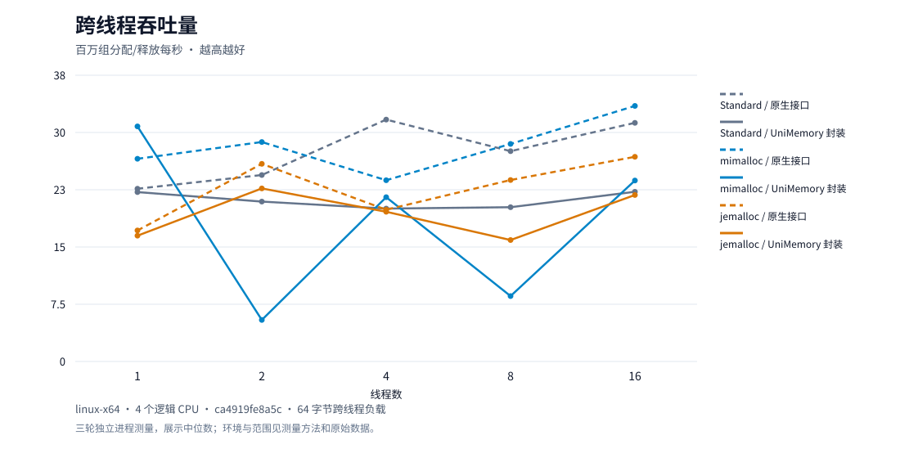

### Windows x64

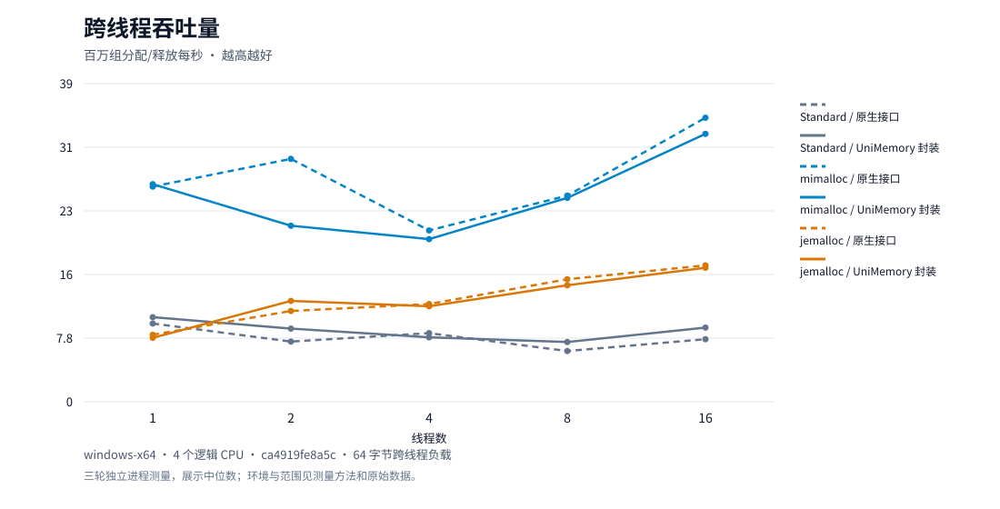

### macOS ARM64

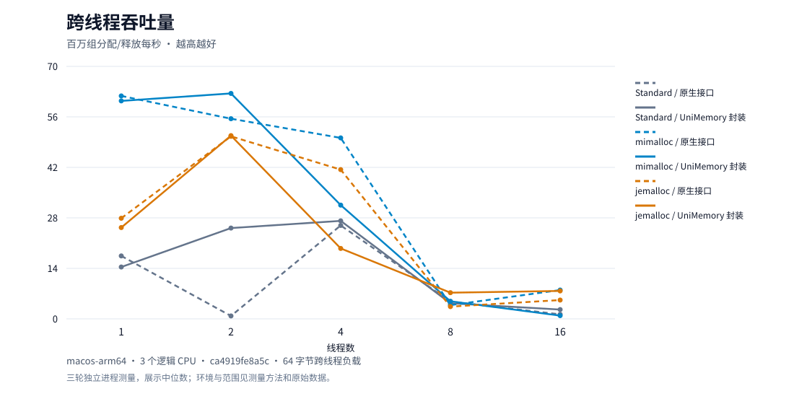

## 2 · 峰值内存

**看同一负载占用多少驻留内存，越低越好。** 包含线程栈、进程和分配器状态。

### Linux x64

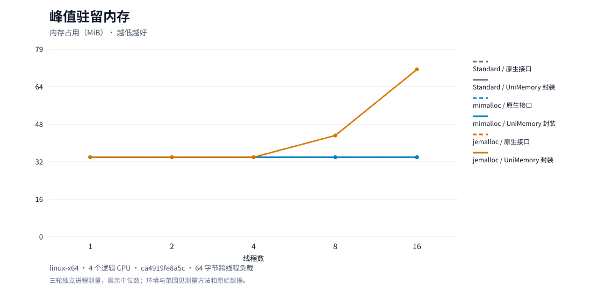

### Windows x64

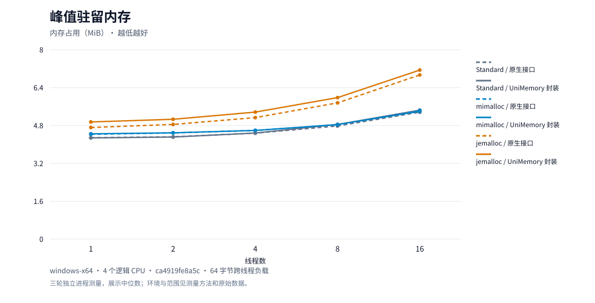

### macOS ARM64

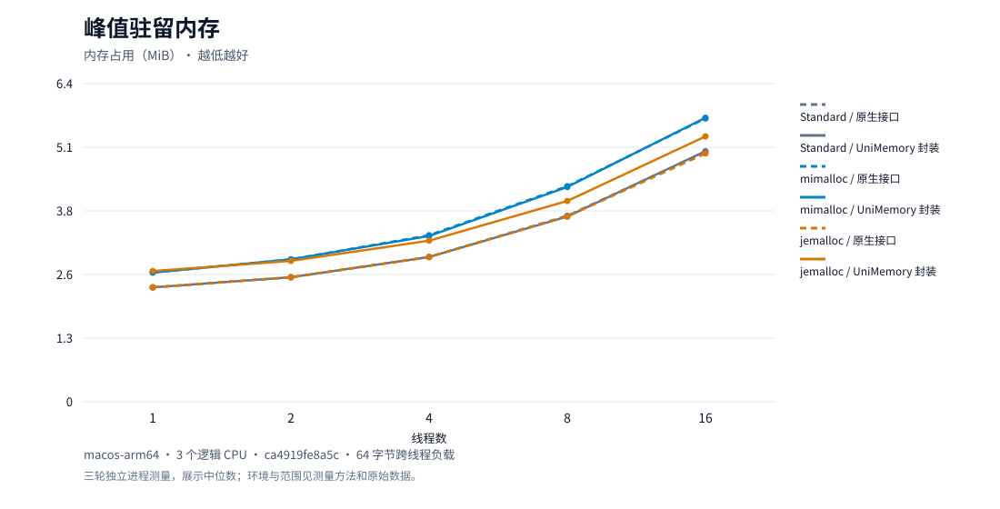

## 3 · 尾延迟

**看不同大小分配的慢请求，越低越好。** P99 表示 99% 的样本不超过该延迟，数值包含时钟开销。

### Linux x64

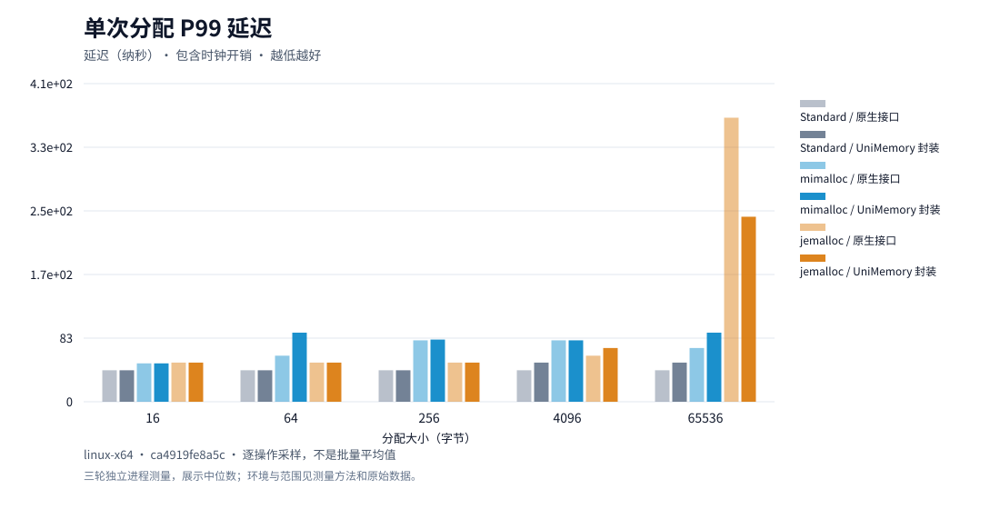

### Windows x64

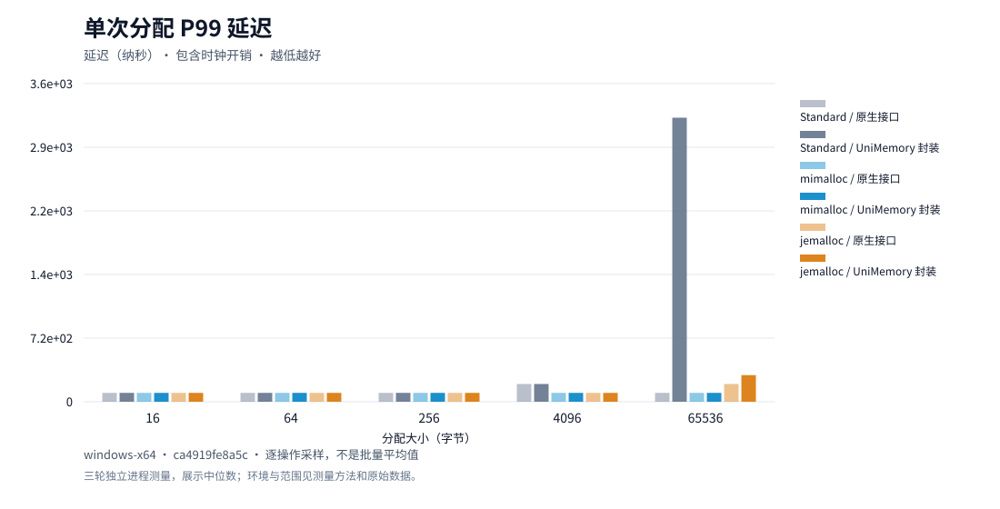

### macOS ARM64

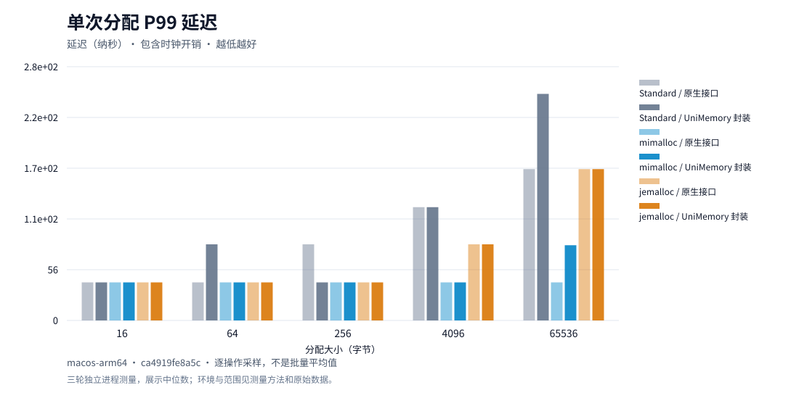

## 4 · 统计开销

**看开启统计增加多少延迟。** 同一后端、同一大小内比较；纹理柱表示开启统计。

### Linux x64

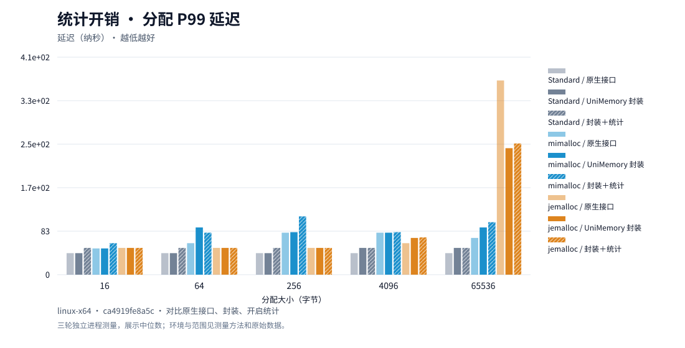

### Windows x64

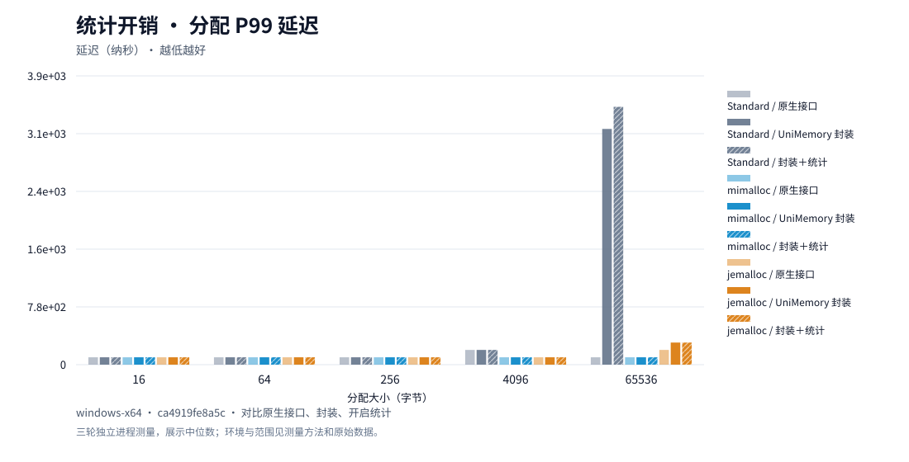

### macOS ARM64

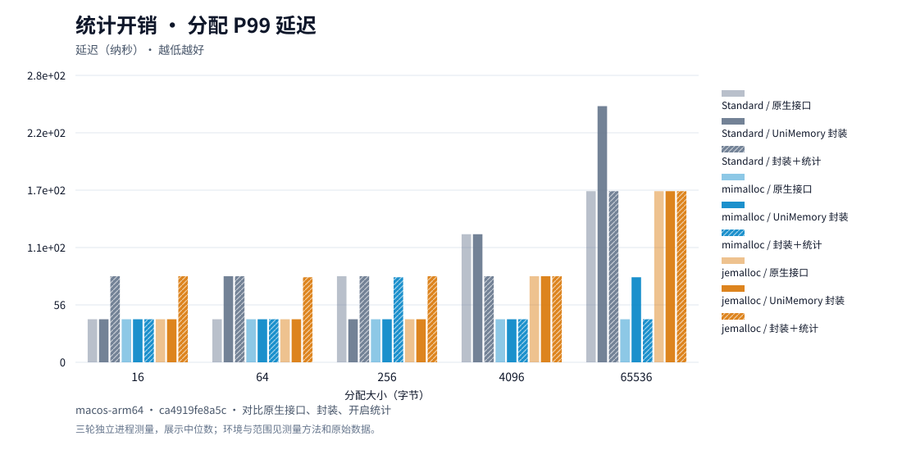

## 5 · 释放后内存

**看分配、保留、循环释放后的内存变化。** 最后阶段已无存活请求，剩余驻留内存可能是缓存，不等于泄漏。

### Linux x64

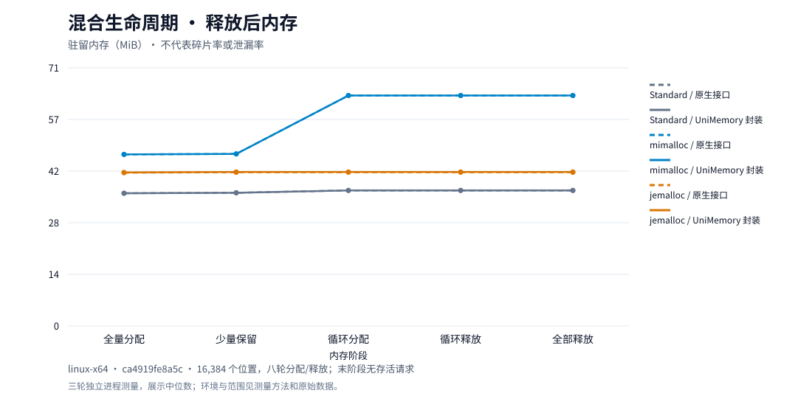

### Windows x64

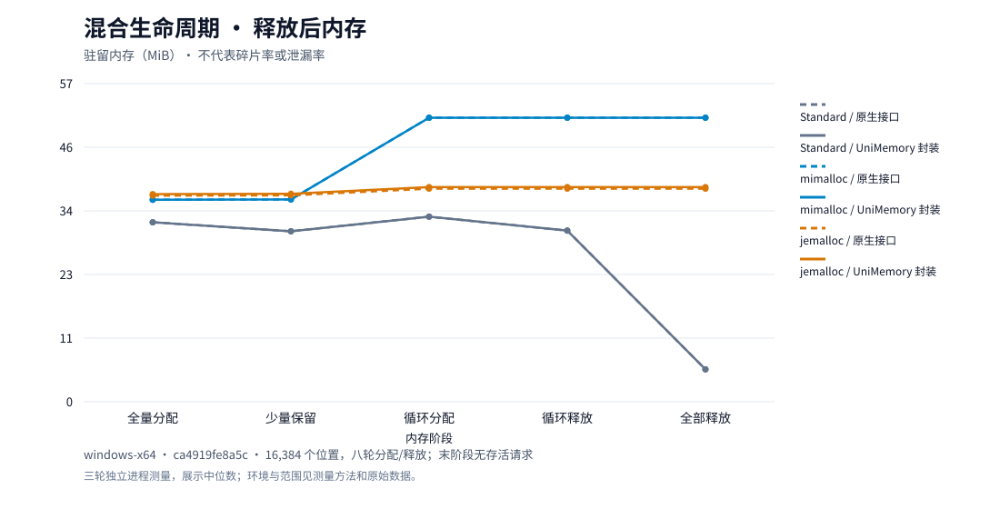

### macOS ARM64

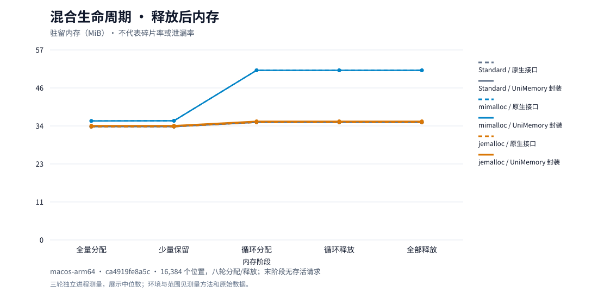

## 6 · 常用操作

**看对象、扩容和容器等操作的相对耗时，越低越好。** 同组 Standard 为 1；不同操作之间不比较绝对耗时。

### Linux x64

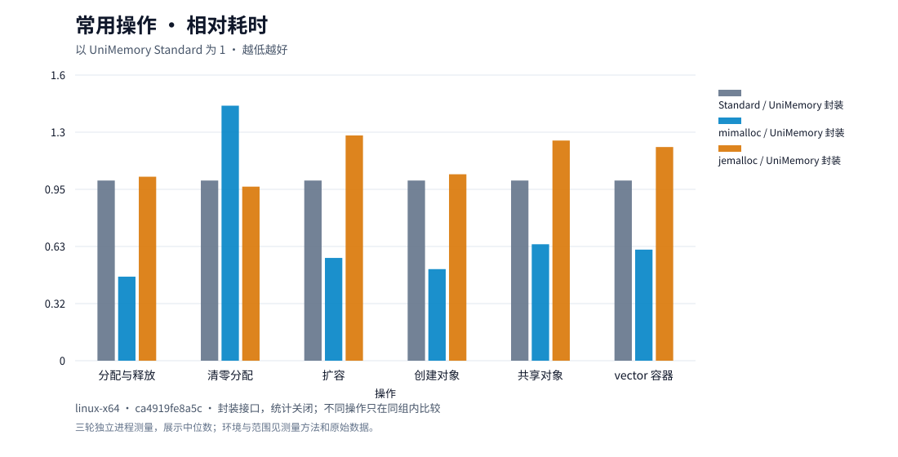

### Windows x64

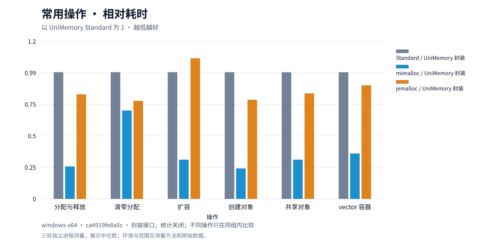

### macOS ARM64

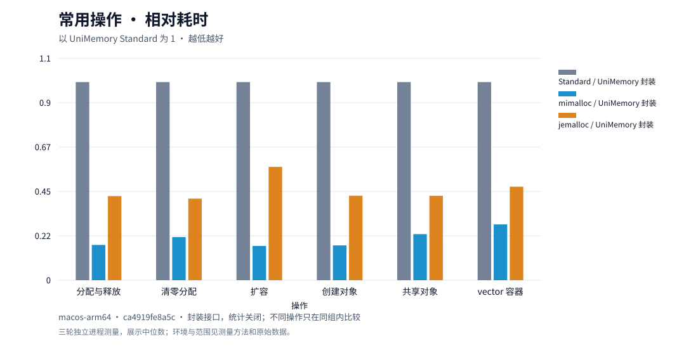

## 历史报告 · 2026-09-28

下图保留 Windows/Linux 的历史使用场景对比。Standard 为 1，条形越短越快；测量环境与当前远程报告不同。

[历史耗时](performance/latency.zh-CN.md) · [历史内存](performance/memory.zh-CN.md) · [原生应用](performance/applications.zh-CN.md)

## 数据与方法

[当前 CSV 与环境](results/current/) · [历史数据](results/0.0.1/README.md) · [测量方法](benchmarking.zh-CN.md)

代码变更后自动更新图表。逐操作样本在 Actions 产物中保留 14 天，汇总数据保存在仓库。共享机器的小幅波动不作为绝对速度门槛；这些结果不代表长期碎片、NUMA 或移动设备性能。
