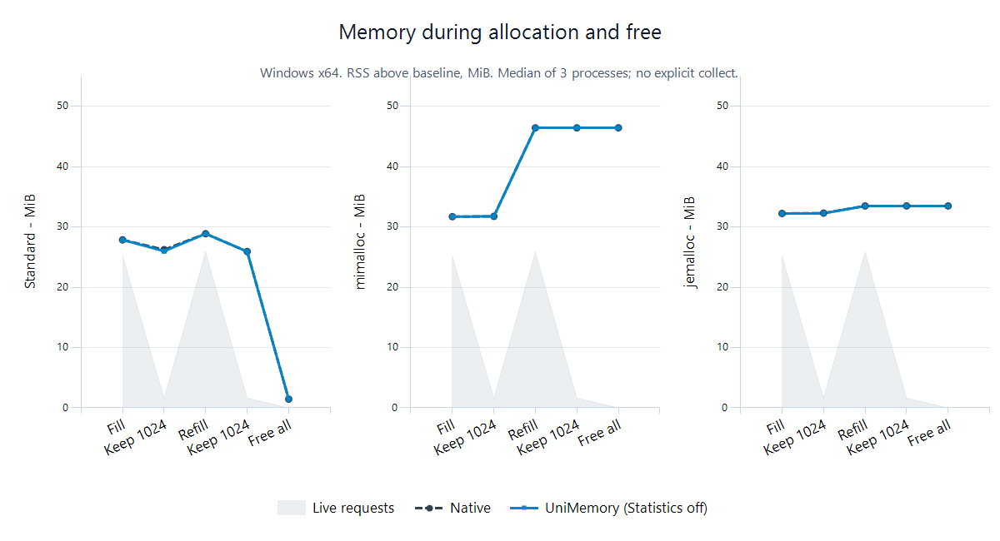

# Memory usage

[Performance](../performance.md) · **English** · [简体中文](memory.zh-CN.md)

**Resident process memory above baseline, MiB.** Median of three fresh processes, counters off.

Requested bytes are storage the application still needs. Resident memory is physical memory held by the process, including allocator-managed storage and metadata. A free ends the application's use of a Block; its storage may remain in the allocator for reuse.

## 1 · Mixed sizes and lifetimes

16384 Blocks, ten sizes from 17–8193 B, eight refill/free cycles. Initial requests: 25.18 MiB; 1024 survivors request 1.61 MiB; final live requests are zero. Pages are touched; alignment, contents and counts are checked.

Snapshots follow the operations without an intentional wait or collection. This checks immediate memory retention after a burst of allocations, not long-term memory usage.

### Windows

| Backend | Path | Fill | Keep 1024 | Free all |
| --- | --- | --- | --- | --- |
| Standard | Native | 27.87 | 25.93 | 1.45 |
| Standard | UniMemory | 27.86 | 25.92 | 1.45 |
| mimalloc | Native | 31.71 | 46.43 | 46.44 |
| mimalloc | UniMemory | 31.70 | 46.43 | 46.43 |
| jemalloc | Native | 32.23 | 33.49 | 33.49 |
| jemalloc | UniMemory | 32.21 | 33.46 | 33.46 |

### Linux / WSL

| Backend | Path | Fill | Keep 1024 | Free all |
| --- | --- | --- | --- | --- |
| Standard | Native | 25.59 | 26.37 | 26.37 |
| Standard | UniMemory | 25.59 | 26.37 | 26.37 |
| mimalloc | Native | 34.19 | 50.32 | 50.32 |
| mimalloc | UniMemory | 34.19 | 50.32 | 50.32 |
| jemalloc | Native | 31.97 | 33.30 | 33.30 |
| jemalloc | UniMemory | 31.97 | 33.30 | 33.30 |

The chart connects phase snapshots, not a continuous time series. Freed storage may remain cached. RSS includes metadata and process state; retention alone is not a leak or fragmentation rate.

In this Windows workload, Standard retains less immediately after free. Native and UniMemory measurements are close; the layer adds no substantial memory usage in this trace. This measurement does not separate caches, metadata and pages awaiting return.

## 2 · Size rounding

Usable capacity can exceed the request. For these deliberately selected sizes, mimalloc and jemalloc Native/API usable capacity both exceed requests by **25.04%**. Standard has no portable capacity query. This excludes metadata/caches and is not an external-fragmentation rate.

## 3 · Heap collect

16384 × 4096 B: 64 MiB, fully touched. Free each Block, then call collect() only on independent Heap.

| Platform | Backend | Kind | Live | Free | Collect |
| --- | --- | --- | --- | --- | --- |
| Windows | Standard | Global | 69.61 | 0.29 | — |
| Windows | mimalloc | Global | 64.31 | 64.32 | — |
| Windows | mimalloc | Heap | 64.29 | 64.29 | 0.29 |
| Windows | jemalloc | Global | 70.52 | 70.52 | — |
| Windows | jemalloc | Heap | 70.09 | 70.09 | 6.12 |
| Linux | Standard | Global | 64.38 | 0.25 | — |
| Linux | mimalloc | Global | 66.14 | 66.14 | — |
| Linux | mimalloc | Heap | 66.13 | 66.13 | 2.13 |
| Linux | jemalloc | Global | 66.32 | 66.32 | — |
| Linux | jemalloc | Heap | 66.32 | 66.32 | 2.43 |

collect() reclaims eligible idle resources; it does not destroy live Objects or guarantee an immediate memory decrease.

## 4 · Library storage

| Type | x64 bytes |
| --- | --- |
| Memory | 80 |
| OwnedBlock | 32 |
| Allocator<T> | 8 |

Memory embeds Stack state and its PMR resource; Stack setup requires no separate state allocation. The Global registry persists. Basic counters and native Heaps have additional state excluded from this table. Sizes depend on ABI.

Linux uses smaps_rollup RSS; Windows uses the working set. OS peak-memory counters differ from phase RSS snapshots.

[Method](../benchmarking.md) · [Raw data](../results/0.0.1/README.md) · [Native programs](applications.md)
